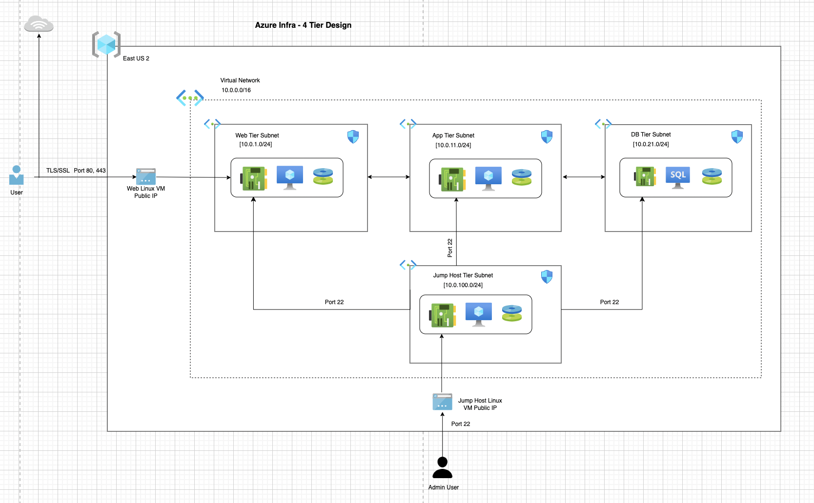

## Create Azure Linux VM using Terraform

### Introduction
- The following Azure Resources will be created
1. azurerm_public_ip
2. azurerm_network_interface
3. azurerm_network_security_group
4. azurerm_network_interface_security_group_association
5. Terraform Local Block for Security Rule Ports
6. Terraform `for_each` Meta-argument
7. azurerm_network_security_rule
8. azurerm_linux_virtual_machine
9. Terraform Outputs for above listed Azured Resources
10. Terraform Functions
- [file](https://www.terraform.io/docs/language/functions/file.html)
- [filebase64](https://www.terraform.io/docs/language/functions/filebase64.html)
<!-- - [base64encode](https://www.terraform.io/docs/language/functions/base64encode.html) -->


### Pre-requisite: Create SSH Keys for Azure Linux VM

### Create Folder
mkdir ssh-keys

### Create SSH Key
cd ssh-keys
```
ssh-keygen -m PEM -t rsa -b 4096 -C "azureuser@myserver" -f terraform-azure.pem
```
Note: If passphrase is entered during generation, the passphrase must be provided during login to the VM.

### Files Generated after above command
Public Key: terraform-azure.pem.pub -> Rename as terraform-azure.pub
Private Key: terraform-azure.pem

### Permissions for Pem file
chmod 400 terraform-azure.pem

The image below shows the architecture diagram for the various servsers.



### Connect to Jump Host linux VM

1. Connect to Jump Host Linux VM
```
ssh -i ssh-keys/terraform-azure.pem azureuser@<Jump-Host-LinuxVM-PublicIP>
cd /tmp
ls
```
2. Use null resource and provisioner to copy the ssh private key file from local source to the jump host VM.
terraform-azure.pem file will be present in /tmp directory of the jump host

### Connect to Web Linux VM using Bastion Host VM
1. Connect to Web Linux VM
```
ssh -i ssh-keys/terraform-azure.pem azureuser@<Web-LinuxVM-PrivateIP>
cd /var/log
sudo tail -100f cloud-init-output.log
cd /var/www/html
ls -la
cd /var/www/html/app1
ls -la
```

