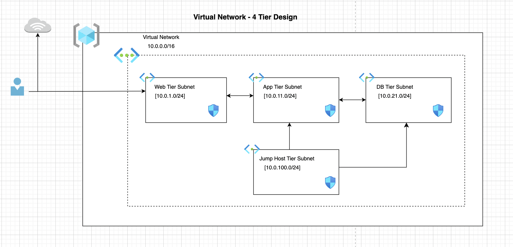

### Design 4-Tier Azure Virtual Network using Terraform

__This is a 4-Tier virtual network configuration__ with Network Security Groups Rules created for the

* Jump Host on SSH - port 22 with source from the Internet.
* Application server on Port 80 and 443 with source from the web server and SSH on port 22 with source from the jump host.
* Web server on port 80 and 443 with source from the internet and SSH on port 22 with source from the jump host.
* Mysql db server on port 3306 with source from the application server and SSH on port 22 with source from the jump host.

The image below shows the architecture diagram for the configuration.

